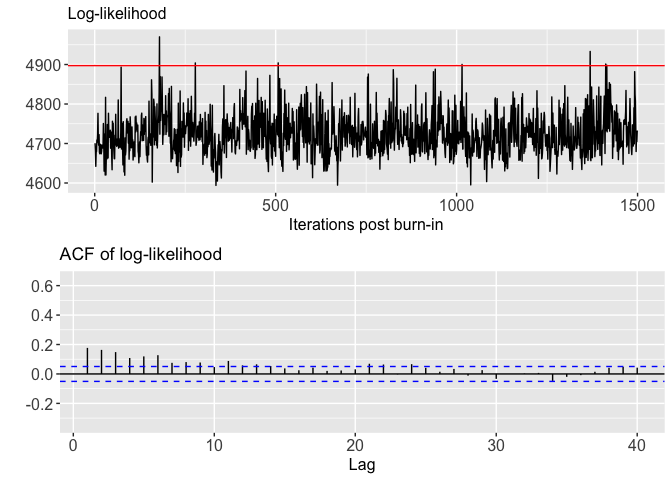

Bayesian Flexible Modelling of Spatially Resolved Transcriptomic Data
================
Arhit Chakrabarti

## Tutorial

We use the function *generate_data* to simulate matrix-variate spatial
data. Sourcing the \`\`**BayesSRT_func.R**” file sources all necessary
functions. We first simulate data from a matrix-variate normal
distribution with 100 randomly generated spatial locations from
$Uni(0,1)$ and 20 rows (genes). The true spatial covariance matrix is
generated from a Matern kernel with smoothness $0.5$, range $1.5$ and
marginal variance $1$. The true scale matrix $\Psi$ is generated from an
AR structure i.e., with $\Psi_{i,j}= \rho^{|i - j|}$ where $\rho = 0.5$.

``` r
# First source the function BayesSRT_func.R file, which loads all the relevant 
# R functions (both custom functions and inbuilt functions)
suppressPackageStartupMessages(source("BayesSRT_func.R"))
datum <- generate_data(n_locs = 100, num_reps = 20, range = 1.5)
```

## Running the proposed MCMC algorithm

We run our proposed Blocked Gibbs sampler for 1000 iterations and
consider first 500 samples as burn-in. We do not consider any thinning
of the samples. We plot the traceplot of log-likelihood for each of the
posterior samples from our sampler and the corresponding
auto-correlation plot. We overlay the traceplot of log-likelihood with
the true value of the log-likelihood.

``` r
Blocked.MCMC = posterior_est(data = datum, n_iterations = 1000, burn = 500, thin = 1)
```

<!-- -->
